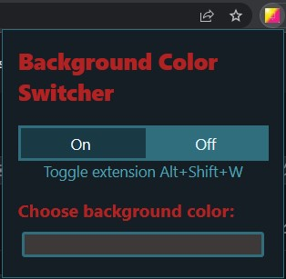

<h2 align="center">Background Color Switcher</h2>
 

Background Color Switcher is a simple chrome browser extension designed to analyze web pages. Background Color Switcher will change the background to the color specified from the user.

  

## Using Background Color Switcher

You can use Background Color Switcher to change background color on your browser!

- Install or download the zip files
- Unpack the zip file
- You will need to enable developer mode in your extension
  > Open the Chrome Menu in the top-right corner of the browser window and select More Tools > Extensions > click top-right corder Developer Mode
- Then click Load unpacked button and select the file unzipped
- Activate the extension in the top right extension icon to select custom background color
  > Shortcut: Shift+Alt+W to switch the background color

## Feature

- According to the background color selected, it will analyze and change the text color to ensure it is having enough contrast
- Shortcut key to toggle the background color can be adjusted
